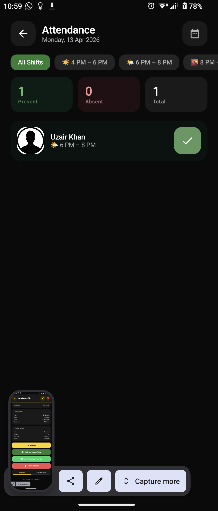
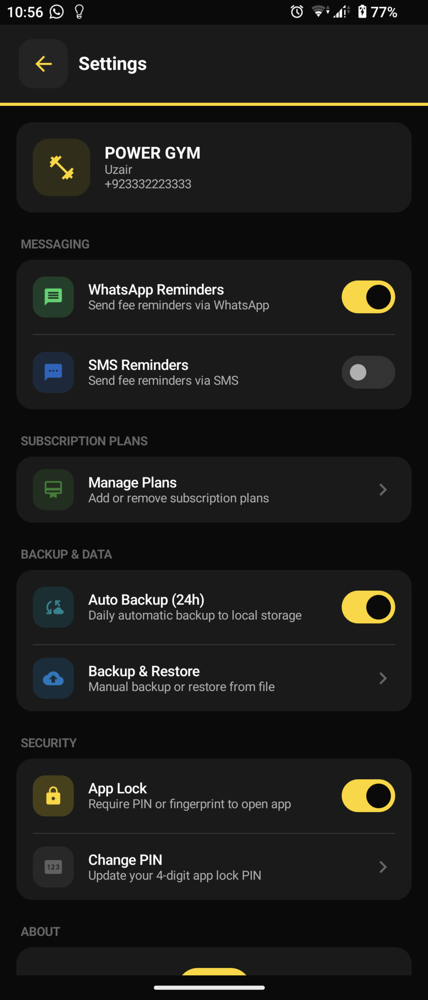

# 🏋️ Gym Manager Pro — Android App

A **complete, production-ready Android gym management system** built with Jetpack Compose,
Room SQLite, and an automated manual-first backup system. Based on the Figma UI design by Engr. Hamza Asad.


## ✅ Key Features

| Feature | Details |
|---|---|
| **Member Management** | Add, view, edit, delete members (soft-delete with confirmation) |
| **App Lock (High Security)** | Biometric (Fingerprint) & 4-digit PIN support. Auto-locks after 5 minutes of inactivity. |
| **Manual Backup & Share** | Generate `.db` backups instantly. One-click save to `Downloads/GymBackup`. |
| **Auto Backup (24h)** | Fully automatic background backup every 24 hours to local storage (if enabled). |
| **Messaging Logic** | Smart toggle system: WhatsApp and SMS reminders are mutually exclusive. |
| **Attendance** | Per-day, per-shift tracking with toggle tap. |
| **Fee Management** | Paid / Unpaid / Partial status; record partial payments with history ledger. |
| **Subscription Plans** | Custom plan management; auto-link on member registration. |
| **Expenses** | Track gym costs by category. |
| **Professional UI** | Clean, emoji-free Settings for a professional look. Optimized Dashboard widgets to prevent text clipping. |
| **Dark Theme** | Full Material3 dark theme matching Figma. |

---

## 🗂️ Project Structure

```
GymManagerPro/
├── app/src/main/
│   ├── AndroidManifest.xml
│   ├── java/com/gymmanager/
│   │   ├── MainActivity.kt              ← NavHost & App Lock Orchestration
│   │   ├── GymApp.kt                    ← Application class & Auto-Backup Scheduler
│   │   ├── data/
│   │   │   ├── model/Entities.kt        ← Room entities (Member, Attendance, Payment …)
│   │   │   ├── db/GymDatabase.kt        ← Room DB with seed data
│   │   │   └── repository/GymRepository.kt
│   │   ├── backup/
│   │   │   ├── DriveBackupManager.kt    ← Local DB Export & URI Restore logic
│   │   │   └── AutoBackupWorker.kt      ← WorkManager for 24h background tasks
│   │   ├── viewmodel/GymViewModel.kt    ← Centralized State Management
│   │   └── ui/
│   │       ├── Screen.kt                ← Navigation routes
│   │       ├── components/              ← Shared custom UI components
│   │       └── screens/
│   │           ├── AppLockScreen.kt     ← Secure Keypad & Biometric UI
│   │           ├── SettingsScreen.kt    ← Configuration (Mutual Exclusive Toggles)
│   │           ├── BackupRestoreScreen.kt ← Manual File-based Backup/Restore
│   │           └── ... (Dashboard, Member Profile, etc.)
```

---

## 🔁 Backup & Restore Flow

The app uses a **Manual-First Security Model** for data protection:

### 1. Manual Backup (One-Click)
- Navigate to **Settings → Backup & Restore**.
- Tap **Create Backup**.
- The app generates a encrypted-ready `.db` file in `Downloads/GymBackup/`.
- **Note**: The app automatically deletes old backups in that folder, keeping only the latest version to save space.

### 2. Automatic 24h Backup
- Enable **Auto Backup** in Settings.
- The app uses Android `WorkManager` to silently create a fresh fresh backup in `Downloads/GymBackup/` every 24 hours.

### 3. Restoring Data
- Tap **Restore from File**.
- Select any previously saved `.db` file using the system file picker.
- The app validates and replaces the current database instantly. (Always backup before restoring!)

---

## 🛡️ Security Features

- **5-Minute Grace Period**: The app only locks if it has been in the background for more than 5 minutes.
- **App-Specific PIN**: Uses a dedicated 4-digit PIN independent of the phone's lock screen.
- **Haptic Keypad**: Professional PIN entry with shake animations on error and haptic feedback.
- **Biometric Integration**: Seamless Fingerprint prompt on launch.

---

## ⚙️ Setup Instructions

### 1. Prerequisites
- **Android Studio Hedgehog** or newer
- **JDK 17**
- **Android SDK** (API 24 minimum, API 34 target)

### 2. Build & Run
1. Open the project in Android Studio.
2. Wait for Gradle sync.
3. Select a physical device or emulator.
4. Click **Run**.

---

## 🎨 Design Credits
UI design by **Engr. Hamza Asad** (Figma)  
Android implementation: Jetpack Compose + Material3 dark theme

---

## 📦 Key Dependencies
- **Jetpack Compose**: Modern UI toolkit.
- **Room Database**: Local SQLite storage.
- **WorkManager**: Reliable background backup scheduling.
- **Biometric**: Secure fingerprint authentication.
- **DataStore**: Lightweight reactive settings storage.
- **Material3**: Latest Google design system.

  ---

## 📸 Screenshots

<p align="center">
  
  
  
  
</p>
<p align="center">
  
  
</p>

---
