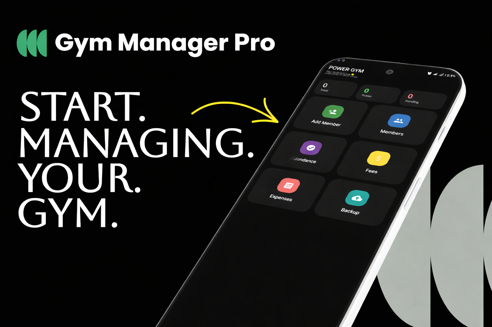
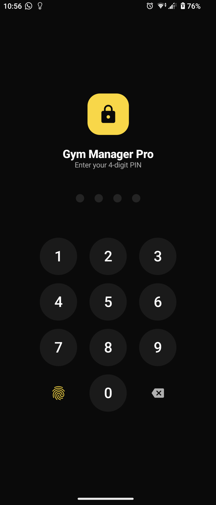
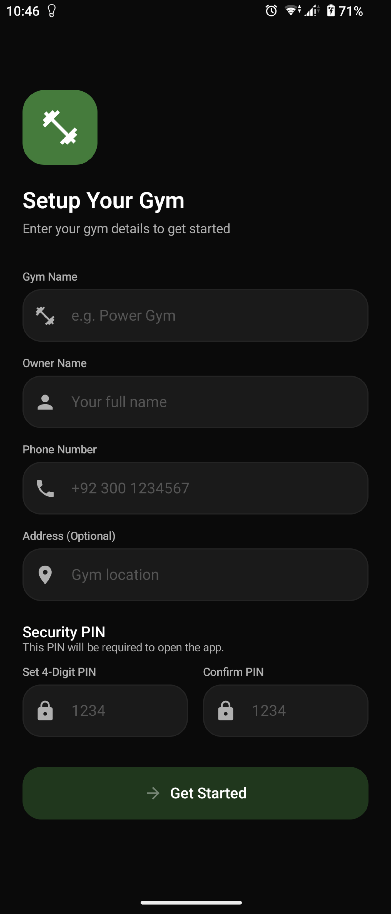
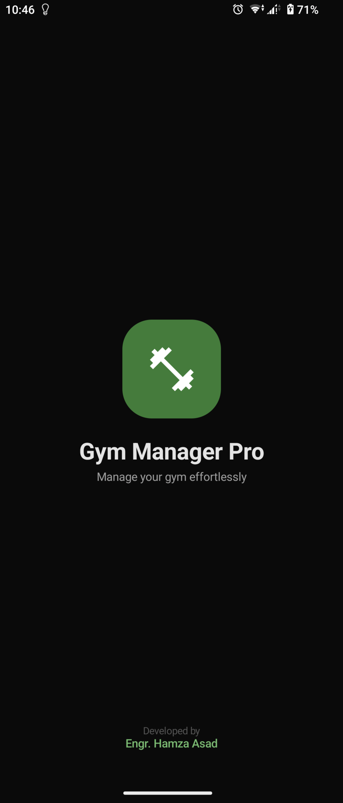
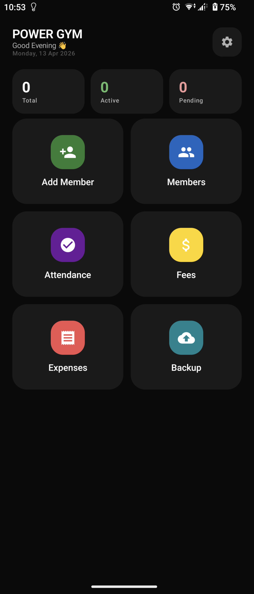
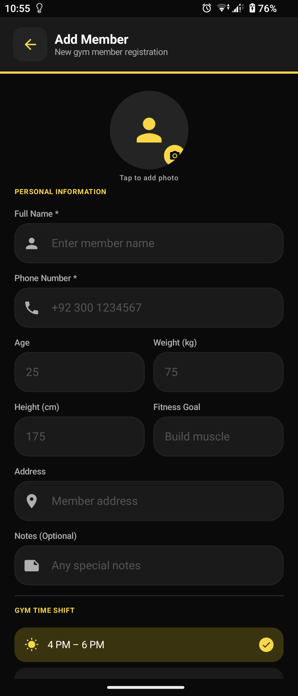
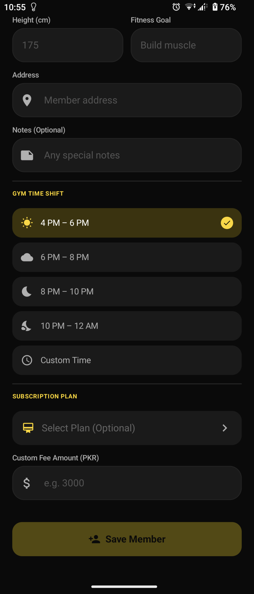
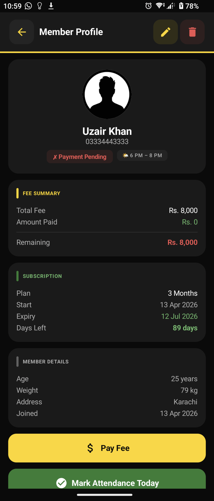
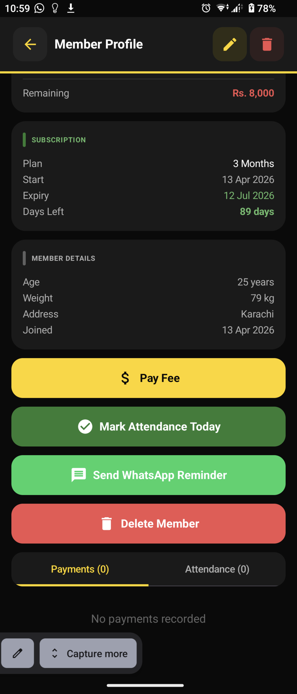

# 🏋️ Gym Manager Pro — Android App (v2.1)

  

  <b>Production-ready, offline-first gym management system</b> 
  Built with Jetpack Compose, Room SQLite, and secure backup architecture

  Designed by <b>Engr. Hamza Asad</b> • Developed for real-world usage

---

## 📸 Screenshots

  

  
  
  
  

  
  
  
  

---

## 🚀 Overview

**Gym Manager Pro v2.0** is a fully offline-capable Android application designed to help gym owners manage members, fees, attendance, and data securely — without relying on internet connectivity.

It emphasizes:

* 🔐 Data security
* ⚡ Fast performance
* 📡 Offline-first architecture
* 📦 Reliable backup & restore

---

## ✅ Key Features (v2.0.0)

| Feature                      | Description                                                                    |
| :--------------------------- | :----------------------------------------------------------------------------- |
| 🔄 **Hotspot Sync**          | Transfer data between devices using local Wi-Fi hotspot (no internet required) |
| 📦 **ZIP Backups**           | Backup database + member images into a single `.zip` file                      |
| 👤 **Member Management**     | Add, edit, block/unblock members with CNIC-based unique ID                     |
| 🖼️ **Secure Image Storage** | Profile images stored in private app storage                                   |
| 🔐 **Hybrid App Lock**       | Biometric + PIN authentication with instant lock                               |
| ⏱️ **Auto Backup (24h)**     | Scheduled backups using WorkManager                                            |
| 💬 **Messaging**             | One-tap WhatsApp & SMS fee reminders                                           |
| 📅 **Attendance Tracking**   | Daily attendance with shift support                                            |
| 💰 **Fee Management**        | Track paid, unpaid, and partial payments                                       |
| 📊 **Subscription Plans**    | Create and manage custom plans                                                 |
| 🧠 **Intelligent Renewal**   | Handles skipped months with cumulative dues                                    |
| ⚠️ **Expiry Alerts**         | Dashboard warning for expiring memberships (≤5 days)                           |
| 🎨 **Modern UI**             | Clean dark theme with Material 3                                               |

---

## 📲 Offline Sync (Phone-to-Phone Transfer)

### 🔹 Phone A (Source Device)

* Enable **Mobile Hotspot**
* Open: `Settings → Sync Data`
* Tap **Host Data**
* Copy the IP address (e.g., `192.168.43.1`)

### 🔹 Phone B (Target Device)

* Connect to hotspot
* Open: `Settings → Sync Data`
* Tap **Receive Data**
* Enter IP → Start Sync

✅ All data (members, images, records) transfers instantly

---

## 🔁 Backup & Restore System

### 📤 Manual Backup

* Go to: `Settings → Backup & Restore`
* Tap **Create Backup**
* File saved in: `Downloads/GymBackup/`
* Format: `GymBackup_YYYYMMDD_HHMMSS.zip`

### 📥 Restore Backup

* Tap **Restore from File**
* Select `.zip`
* Data + images restored automatically

---

## 🛡️ Security Features

* Instant lock on app minimize or screen off
* App-specific PIN system
* Biometric authentication (Fingerprint)
* Private internal storage for sensitive data

---

## ⚙️ Tech Stack

* **Jetpack Compose** — Declarative UI
* **Material 3** — Modern design system
* **Room (SQLite)** — Local database
* **WorkManager** — Background tasks & backups

---

## ⚙️ Setup Instructions

### 📋 Prerequisites

* Android Studio Hedgehog or newer
* Android device (API 24+)

### ▶️ Run Project

1. Open project in Android Studio
2. Click **Run**

---

## 🛡️ Privacy Policy

Read full policy:
👉 https://github.com/Hamza-Zehri/GymManagerPro/blob/master/PRIVACY_POLICY.md

---

## 🎨 Credits

* **UI Design:** Engr. Hamza Asad (Figma)
* **Development:** Native Android (Jetpack Compose)

---

## ⭐ Support

If you find this project useful, consider giving it a ⭐ on GitHub!
